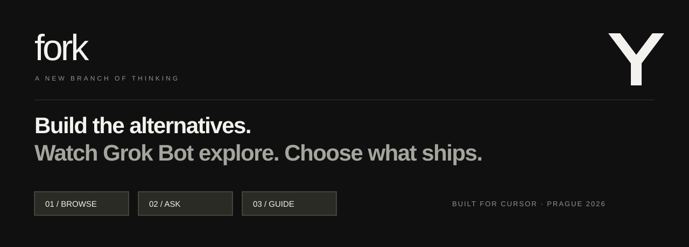
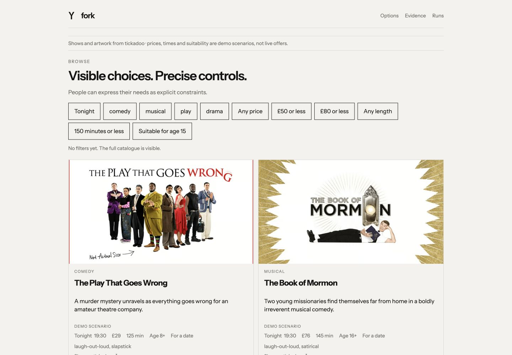
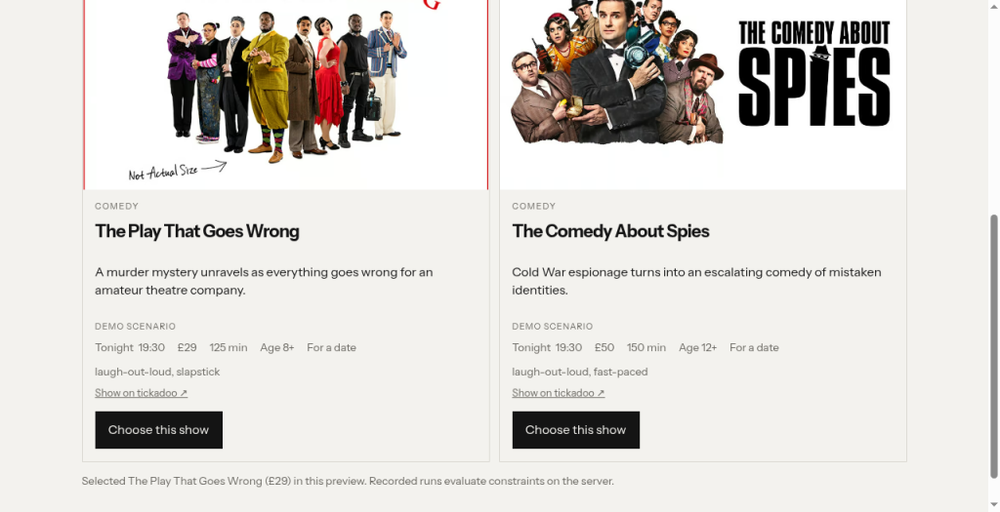

<div align="center">



[](https://github.com/Mark-Prethero/get-fork/actions/workflows/ci.yml)


**A new branch of thinking.**

**Built for solo builders and small to medium teams.**

When a coding agent asks “How should this work?”, Fork turns the question into working alternatives, browser investigations, and a decision the agent can use. Explore product choices inside your development workflow, especially when you do not have a dedicated product team.

[**Visit Fork →**](https://get-fork.pages.dev/) · [**Try the demo →**](https://get-fork-demo.proud-wood-517d.workers.dev/) · [**Explore the evidence →**](https://get-fork-demo.proud-wood-517d.workers.dev/compare)

</div>

## One question. Three working futures.

**How should people find their next show?** Browse, Ask and Guide share the same catalogue and mission. Each expresses a different product bet.

| Alternative | Interaction | Product bet |
| --- | --- | --- |
| **Browse** | Visible cards and explicit filters | People want to see and control their choices. |
| **Ask** | Natural language with Grok | People want to describe what they need. |
| **Guide** | A short sequence of questions | People want help narrowing the decision. |

The show catalogue is the example. **Fork is the workflow.**

## Your product. Your question.

Use the same loop for checkout, onboarding, search, pricing or another product decision. Configure the question, build the working alternatives, define missions and personas, then let Grok Bot investigate before choosing what to ship.

This repo is a working show-discovery example. To adapt it, update `fork.config.json`, the variant implementations, domain fixtures and mission evaluators. The current catalogue and constraint rules are show-specific; changing domains requires adapting those components, rather than selecting a universal dropdown.



Nine real tickadoo show names and public artwork make the alternatives tangible. Cards link to their tickadoo source. Prices, times, ages and suitability are labelled **demo scenarios**, rather than live inventory.

## Start from Cursor

Clone this repository, open the folder in Cursor, then in Agent chat select `/fork` and add your product question:

```bash
git clone https://github.com/Mark-Prethero/get-fork.git
```

This uses Cursor’s [project command support](https://docs.cursor.com/en/agent/chat/commands). There is no one-click installer or marketplace extension; adapting this workflow to another existing product requires the configuration and domain changes described above.


```text
/fork How should people find their next show? Compare browse, ask and a guided flow.
```

The repo includes the actual [Cursor command](.cursor/commands/fork.md) and an [always-on rule](.cursor/rules/fork.mdc). The command tells Cursor to read prior decisions, propose a shortlist, build the approved alternatives, validate previews and generate the Grok Bot mission handoff. Fork does not automatically remote-control Cursor or dispatch into the Grok Bot app: the operator transfers the mission. After the investigation, the human choice becomes a Cursor handoff; authenticated recording and explicit adoption update repository context.

## The 60-second pitch

Open the [one-minute pitch view](https://get-fork-demo.proud-wood-517d.workers.dev/pitch). It tells the story with completed Bot findings; a fresh investigation is not needed on stage. The live alternatives, original Bot captures and decision handoff are available from that view for questions.

Optional working walkthrough:

1. **Start:** show the `/fork` prompt on the homepage: Cursor frames and builds the alternatives.
2. **Explore:** open [Ask](https://get-fork-demo.proud-wood-517d.workers.dev/v/ask), click the Date night example, then choose a show. The other alternatives remain one tab away.
3. **Watch:** follow Watch Grok Bot to the [real walkthroughs](https://get-fork-demo.proud-wood-517d.workers.dev/walkthrough). Three correctly named chats in the Grok Bot app provide the original reports. Detailed recorded evidence is available separately.
4. **Decide:** review your own selected example alongside the three real Bot walkthroughs, then choose, revise or defer an approach and explain why. Public visitors create a draft; an authenticated operator records the decision with an immutable evidence snapshot.
5. **Continue building:** copy or download the Cursor handoff. It includes the reason, evidence links and next steps. Recorded decisions can be exported and adopted with the CLI.

## Fresh Grok Bot walkthrough

The Bot explored the updated tickadoo Browse demo and changed from **Faulty Towers** (£68 demo scenario) to **The Play That Goes Wrong** (£29) when the budget dropped to £50. It returned actual screenshots and a short trace.

[**Watch the fresh walkthrough →**](https://get-fork-demo.proud-wood-517d.workers.dev/walkthrough) · [**Read the archived Bot report →**](walkthroughs/tickadoo-browse)



This public walkthrough is operator-archived, separate from the server-recorded comparison grid. It has no server constraint receipt or per-action timestamps.

### Two additional personas, actually run

| Grok Bot chat | Approach | Observation | Report |
| --- | --- | --- | --- |
| Fork — Speedrunner | Ask · 390 × 844 mobile emulation | Grok returned The Comedy About Spies (£50). The Bot found the next action below the artwork; the next build moves it above the artwork. | [Actual reply and trace](walkthroughs/speedrunner-ask) |
| Fork — Group Organiser | Guide · actual 1024 × 525 | Faulty Towers (£68) → The Mousetrap (£48) after the budget twist. The Bot confirmed a clear next step. | [Actual final screenshot and trace](walkthroughs/group-organiser-guide) |

Both explored captured build 2026-09-30.5 and returned reports in the Grok Bot app. These are public walkthroughs with no server run token or receipt; their original observations are preserved.

## Where Grok Bot fits

**Grok Bot is the browser investigator.** An operator queues a mission in Runs, copies its handoff into the real Grok Bot app, and the Bot explores the alternative in its browser. Screenshots, actions, outcome and constraint receipts are saved for replay. Remote dispatch from Fork to the Bot app is currently a manual handoff.

**Grok powers Ask through the xAI API.** That live conversation is a separate role from Grok Bot driving the browser. The server calls `grok-4.20-0309-non-reasoning`; keys remain on the Worker.

The original four investigations include two successful walkthroughs and two Ask failures caused by a missing API key. Those failures remain visible. New attempts never overwrite the original evidence. The current Ask integration is configured and has been verified live.

Agent walkthroughs are **not real-user research**. Unrun combinations remain “Not run”; phone frames are “Mobile emulation”. Original recordings retain their original build and catalogue. The archived catalogue prevents later artwork changes from rewriting history.

## From evidence back to code

```text
Product question → Working alternatives → Grok Bot investigation
                                             ↓
Cursor continues ← Adopted config ← Decision + evidence snapshot
```

```bash
node scripts/fork.mjs status
node scripts/fork.mjs queue
node scripts/fork.mjs record --action defer --reason "Need another mission"
node scripts/fork.mjs record --decision <saved-decision-id>
node scripts/fork.mjs adopt --variant guide --decision <saved-decision-id>
```

`adopt` requires a recorded choose decision. It updates `src/config/show-search.ts` only after the server accepts the adoption; deployment is a separate step. `record --decision` exports the existing saved snapshot without creating a duplicate decision.

## Run locally

Requires Node.js 22.

```bash
npm ci
cp .dev.vars.example .dev.vars
npm run setup
npm run dev
```

Open **http://127.0.0.1:8787**. Set `ADMIN_KEY` and `BOT_INGEST_KEY` in `.dev.vars`, and `XAI_API_KEY` for Ask. Without a key, Ask reports that it is unavailable. Never commit `.dev.vars`.

```bash
npm run check
```

This runs TypeScript checks, constraint tests, the production build and a Worker deployment dry run. GitHub Actions runs the same checks on pull requests and pushes to `main`.

## Small stack, complete loop

| Layer | Implementation |
| --- | --- |
| UI | Vite + TypeScript; three independent alternatives |
| API | Hono on Cloudflare Workers |
| State | D1: runs, decisions and model-call reservations |
| Screenshots | Workers KV for new uploads; static assets for original captures |
| AI | Server-side xAI calls with visible failures and a bounded demo budget |
| Agent handoff | Grok Bot mission prompt + run-scoped ingestion token |
| Coding workflow | Fork CLI and a Cursor command |
| Hosting | Git-connected Cloudflare Pages landing + Worker application |

Useful entry points: [`SPEC.md`](SPEC.md), [`bot/FORK_BOT.md`](bot/FORK_BOT.md), [`.cursor/commands/fork.md`](.cursor/commands/fork.md), [`src/worker.ts`](src/worker.ts), [`client/src`](client/src), [`evidence`](evidence).

<details>
<summary><strong>Deployment and operational details</strong></summary>

The demo uses Northbound Studio's Cloudflare account. Pages builds `landing/` from `main`. The Worker explicitly uses `wrangler.worker.jsonc` so Pages does not ingest the application's Worker configuration.

```bash
npm ci
npm run check
npx wrangler d1 migrations apply fork-demo --remote -c wrangler.worker.jsonc
npm run deploy
```

Set `XAI_API_KEY`, `ADMIN_KEY` and `BOT_INGEST_KEY` with `wrangler secret put <name> -c wrangler.worker.jsonc`. Generate binding types with:

```bash
npx wrangler types src/worker-bindings.d.ts -c wrangler.worker.jsonc \
  --include-runtime=false --strict-vars=false --env-interface=WorkerBindings
```

Upstream model attempts are reserved before fetch and count toward the 40-call demo budget even on failure. The shared deadline is 20 seconds; the initial eight-second deadline expired before valid responses arrived. Rate limits and per-run limits also apply. No substitute recommendations hide an upstream failure.

Retry unsuccessful required runs from Runs after saving an admin session. Retries create linked attempts. Queuing is not Bot execution: the operator must complete the handoff.

Original exports retain build `2026-09-30.1`. Snapshot fields were reconstructed from that build's committed source; missing capture and finish timestamps are not inferred. Current visual examples use catalogue `2026-09-30.3`.

</details>

---

Built at the Prague hackathon, September 2026. Continued and verified by **Mark Prethero · Codex · Mark MacBook**.
