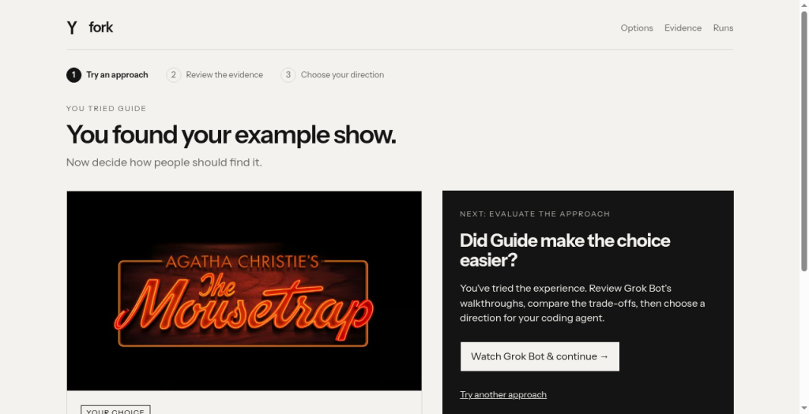

# Fork — Group Organiser: Guide

Real public Grok Bot walkthrough, 30 September 2026. Captured build 2026-09-30.5. Report returned at 17:11:16 Prague time; screenshot capture timestamps were not supplied. Archived by Mark Prethero · Codex · Mark MacBook.

Mission: a show tonight for adults and a 15-year-old, at most 150 minutes, first £80 then £50 per person.

- Provisional: Faulty Towers The Dining Experience — demo £68, tonight 19:30, 120 minutes, age 14+.
- Final: The Mousetrap — demo £48, tonight 19:30, 130 minutes, age 12+.

The Bot opened a fresh tab, answered five Guide questions, chose provisionally, used Make another show choice, repeated the Guide with £50, then selected the final show. It reported 13 in-page interactions (14 including the tab), about two minutes, and no friction. It confirmed the next-step links were clear.

Actual reported viewport: 1024 × 525, normal text scale. The requested 1280 × 800 desktop resize was unsupported.

This public walkthrough had no run session token: no server-recorded run, constraint receipt or per-action timestamps. Prices, times and suitability are illustrative scenarios, not live offers. Agent walkthroughs are not real-user research.
