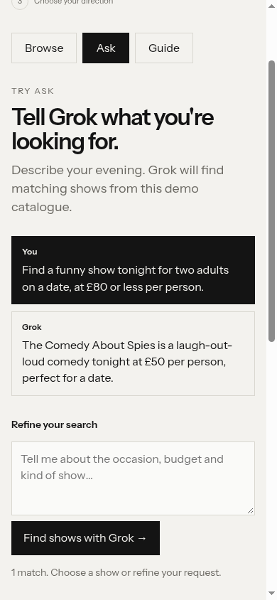

# Fork — Speedrunner: Ask

Real public Grok Bot walkthrough, 30 September 2026. Captured build 2026-09-30.5. Report returned at 17:07:03 Prague time; screenshot capture timestamps were not supplied. Archived by Mark Prethero · Codex · Mark MacBook.

Mission: quickly find a funny show tonight for two adults on a date, £80 or less per person. The Bot reported seven interactions and about one minute: open a fresh Ask tab, resize, send the request, inspect Grok’s reply, choose The Comedy About Spies and inspect the confirmation. Grok returned that show as the only match: demo £50 each, £100 for two, tonight 19:30.

Actual reported viewport: 390 × 844, normal text scale. Resizing worked. This was mobile browser emulation, not a real-phone test.

The Bot confirmed the next step was clear, but needed scrolling to reach the next-step card below the selected show. Build 2026-09-30.7 moves the next action above the artwork on narrow screens; the original capture stays unchanged.

This public walkthrough had no run session token: no server-recorded run, constraint receipt or per-action timestamps. Prices, times and suitability are illustrative scenarios, not live offers. Agent walkthroughs are not real-user research.
