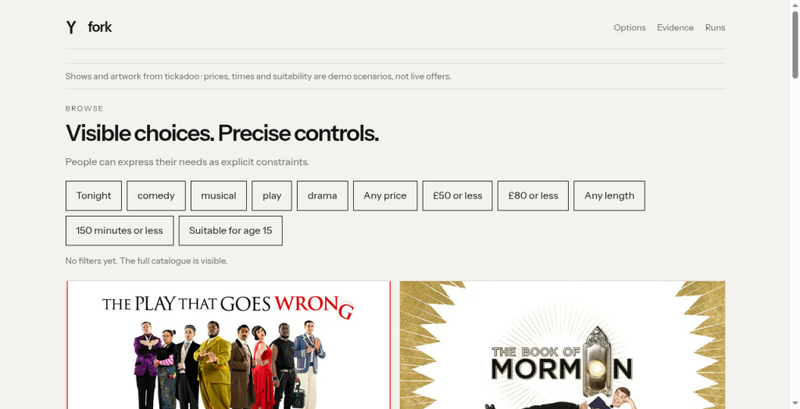

# Grok Bot explores the tickadoo Browse alternative

**Real public browser walkthrough · 30 September 2026 · captured build 2026-09-30.3**

Grok Bot explored the deployed demo in a fresh chat. This report and the attached screenshots were returned by that Bot and archived by Codex on Mark MacBook. This was a public walkthrough without a run session token: it has no D1 run, server constraint receipt, or per-action timestamps. It is kept separate from the formal comparison grid.

## Mission and result

Find a laugh-out-loud show tonight for two people on a date at £80 or less per person, then lower the budget to £50.

- Provisional choice: **Faulty Towers The Dining Experience** — demo scenario £68 per person.
- Final choice: **The Play That Goes Wrong** — demo scenario £29 per person.
- Bot-reported viewport: **1024 × 525**.
- Bot-reported duration: about one minute; seven successful clicks. One stale-element attempt needed a retry.

All prices, showtimes and suitability are illustrative demo data, not live ticket offers.

## Bot-reported action trace

1. Apply Tonight.
2. Apply comedy.
3. Pick The Play That Goes Wrong initially.
4. Apply the £80 filter.
5. Pick Faulty Towers provisionally.
6. Apply the £50 filter.
7. Pick The Play That Goes Wrong finally.

## Friction reported

The cards did not show a venue. There was no party-size control, so the Bot calculated totals from the per-person price. A stale-element click required a retry without changing the page.

These are observations from one agent walkthrough, not evidence of human preference or a universal winner.

## Captured screenshots

Initial state, before filtering:

Final state, after the £50 filter and selection:

Capture timestamps were not supplied in the screenshot attachments. The report appeared in the Grok Bot app at 16:47 Prague time; that is a report time, not an inferred capture time.
